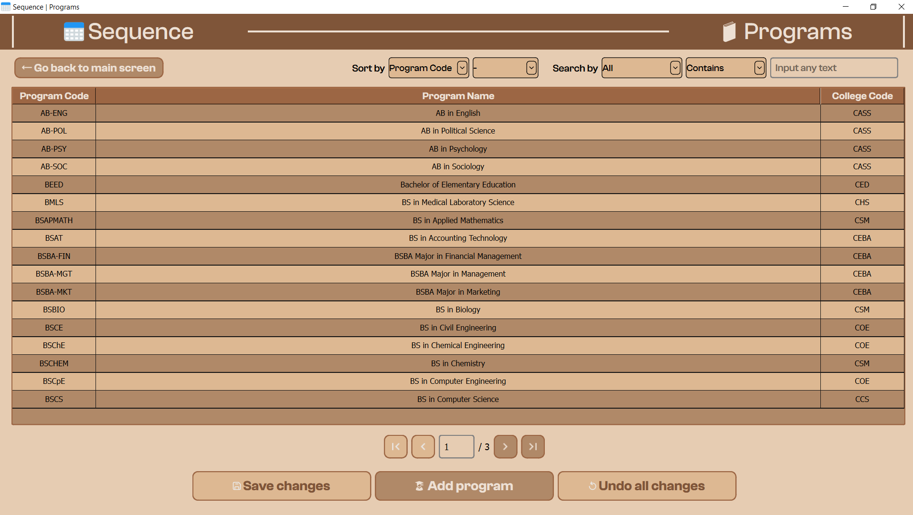

# Sequence, a simple student information system (SSIS)

Sequence is a simple student information system (SSIS) made in accordance with the requirements of CCC151. 

The name 'Sequence' comes from the fact that the data in this application is stored in a particular order, hence, a sequence.

## Requirements
- Python 3.10+
- PyQt6 (Recommended version: 6.8.0+)
- PyMySQL 1.1.1

## Features

- Create, read, update, delete, and list (CRUDL) operations for students, programs, and colleges
- Search and sort operations
- Full screen mode
- Data storage using MySQL
- Utilizes pagination for data display
- Save recent changes or undo all recent changes
- Choose between being in admin or viewer mode
- Display demographics in 'View Demographics' page


## Screenshots





## To run the project on a local machine

Clone the project

```bash
  git clone https://github.com/xbryan25/ccc151-ssis-v1.git
```

Go to the project directory

```bash
  cd ccc151-ssis-v1
```

Create and activate the virtual environment

```bash
  python -m venv ccc151-ssis-v1-venv
  ccc151_ssis_v1_venv\Scripts\activate
```

Once in the virtual environment, install dependencies

```bash
  pip install -r requirements.txt
```

Once the dependencies are installed, create an .env file for your database credentials

- Powershell
```powershell
  ni .env
```
- cmd
```cmd
  type nul > .env
```


In the .env file, input your database credentials and preferred default user mode. For example:

- Open .env file using powershell or cmd
```powershell
  notepad .env
```
- Add and save contents
```env
DB_HOST=localhost
DB_USER=your_username
DB_PASSWORD=your_password

# USER_MODE controls application access level: only 'admin' or 'viewer'
# Will be set to 'viewer' if USER_MODE is not 'admin' nor 'viewer'

USER_MODE=admin
```

Switch to the working directory

```bash
  cd src
```

Run driver.py

```bash
  python driver.py
```

After running the application, deactivate the virtual environment:

```bash
  deactivate
```

## Feedback

If you have any feedback, please reach out to @xbryan25 using this [email](mailto:bryanaganp25@gmail.com)

## License
This project is licensed under the MIT License.